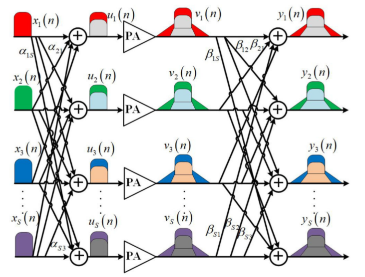
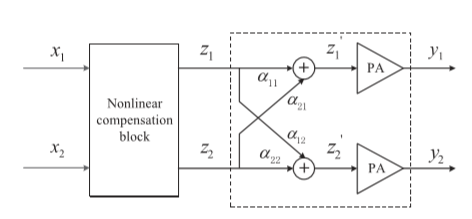

#MIMO DPD
## Exist dpd crosstalk models
1. Crossover memory polynomial model(COMPM)
   
$\begin{aligned}
   y_1(n)=\sum_{\tau=0}^{M}\sum_{k=0}^{K-1}b_{\tau,k,1}^{(1)}x_1(n-\tau)\vert{x_1(n-\tau)}\vert^k+\sum_{\tau=0}^{M}\sum_{k=0}^{K-1}b_{\tau,k,2}^{(1)}x_2(n-\tau)\vert{x_2(n-\tau)}\vert^k+\dots+\sum_{\tau=0}^{M}\sum_{k=0}^{K-1}b_{\tau,k,s}^{(1)}x_s(n-\tau)\vert{x_s(n-\tau)}\vert^k
\end{aligned}$
1. Parallel Hammerstein model(PH)
   
$\begin{aligned}
   y_1(n)=\sum_{\tau=0}^{M}\sum_{k_s=0}^{K-1}\dots\sum_{k_2=0}^{k_3}\sum_{k_1=0}^{k_2}b_{\tau,k_s\dots k_2,k_1,1}^{(1)}x_1(n-\tau)f(n-\tau)+\sum_{\tau=0}^{M}\sum_{k_s=0}^{K-1}\dots\sum_{k_2=0}^{k_3}\sum_{k_1=0}^{k_2}b_{\tau,k_s\dots k_2,k_1,2}^{(1)}x_2(n-\tau)f(n-\tau)+\dots+\sum_{\tau=0}^{M}\sum_{k_s=0}^{K-1}\dots\sum_{k_2=0}^{k_3}\sum_{k_1=0}^{k_2}b_{\tau,k_s\dots k_2,k_1,s}^{(1)}x_s(n-\tau)f(n-\tau)
\end{aligned}$

$f(n-\tau)=f(\vert{x_1(n-\tau)}\vert,\vert{x_2(n-\tau)}\vert,\dots,\vert{x_s(n-\tau)}\vert)=\vert{x_1(n-\tau)}\vert^{k_1}\vert{x_2(n-\tau)}\vert^{k_2-k_1}\dots\vert{x_s(n-\tau)}\vert^{k_s-k_s-1}$ 

1. Dual input crosstalk mismatch model(DI-CTMM)
   
$\begin{aligned}
   y_1(n)=\sum_{\tau=0}^{M}\sum_{k=0}^{K-1}d_{\tau,k,1}^{(1)}x_1^{k/2+1}(n-\tau)x_1^{*k/2}(n-\tau)+\sum_{\tau=0}^{M}\sum_{k=0}^{K-1}d_{\tau,k,2}^{(1)}x_1^{k/2}(n-\tau)x_1^{*k/2}(n-\tau)z_1(n-\tau)+\sum_{\tau=0}^{M}\sum_{k=0}^{K-1}d_{\tau,k,3}^{(1)}x_1^{k/2+1}(n-\tau)x_1^{*(k/2-1)}(n-\tau)z_1^*(n-\tau)+\sum_{\tau=0}^{M}\sum_{k=0}^{K-1}\sum_{j=0}^{k}\sum_{i=0}^{k+1}d_{\tau,k,4}^{(1)}x_1^{k/2+1-i}(n-\tau)x_1^{*(k/2-j)}(n-\tau)z_1^{i}(n-\tau)z_1^{*j}(n-\tau)
\end{aligned}$ 

$z_s(n)=\sum_{r-1}^Sy_r(n)\lambda_{sr}$

Step1 : run a sync, x(n), y(n)  
Step2 : $\lambda_{sr}=1$  
Step3 : $d\hat{}^{(s)}=X_s(x,z)^+y_s$ , $X_s(x,z)$ is a predistorter matrix.  
Step4 : $\begin{bmatrix}
    \mathscr{R}\{\lambda_{s}\}\\
    \mathscr{I}\{\lambda_{s}\}
\end{bmatrix} =
\begin{bmatrix}
\mathscr{R}\{G_s^2+G_s^3\}&\mathscr{I}\{-G_s^2+G_s^3\}\\
\mathscr{I}\{G_s^2+G_s^3\}&\mathscr{R}\{G_s^2-G_s^3\}
\end{bmatrix}^+\times
\begin{bmatrix}
\mathscr{R}\{y_s-g_s^1-g_s^4\}\\
\mathscr{I}\{y_s-g_s^1-g_s^4\}
\end{bmatrix}$  
$g_s^1(n)=\sum_{\tau=0}^{M}\sum_{k=0}^{K-1}\hat{d}_{\tau,k,1}^{(s)}x_s^{k/2+1}(n-\tau)x_s^{*k/2}(n-\tau)$  
$g_s^2(n)=\sum_{\tau=0}^{M}\sum_{k=0}^{K-1}\hat{d}_{\tau,k,2}^{(s)}x_s^{k/2}(n-\tau)x_s^{*k/2}(n-\tau)$   
$g_s^1(n)=\sum_{\tau=0}^{M}\sum_{k=0}^{K-1}\hat{d}_{\tau,k,3}^{(s)}x_s^{k/2+1}(n-\tau)x_s^{*k/2-1}(n-\tau)$  
$g_s^1(n)=\sum_{\tau=0}^{M}\sum_{k=0}^{K-1}\sum_{j=0}^{k}\sum_{i=0}^{k+1}\hat{d}_{\tau,k,4}^{(s)}x_s^{k/2+1-i}(n-\tau)x_s^{*k/2-j}(n-\tau)z_s^i(n-\tau)z_s^{*j}(n-\tau)$  
$G_s^2=diag(g_s^2)Y$  
$G_s^3=diag(g_s^3)Y^*$     

2. New crosstalk model
$\begin{aligned}
   y_1(n)=\sum_{\tau=0}^{M}\sum_{k_s=0}^{K-1}\dots\sum_{k_2=0}^{k_3}\sum_{k_1=0}^{k_2}x_1(n-\tau)l(n-\tau)+\sum_{\tau=0}^{M}\sum_{k_s=0}^{K-1}\dots\sum_{k_2=0}^{k_3}\sum_{k_1=0}^{k_2}x_2(n-\tau)l(n-\tau)+\dots+\sum_{\tau=0}^{M}\sum_{k_s=0}^{K-1}\dots\sum_{k_2=0}^{k_3}\sum_{k_1=0}^{k_2}x_s(n-\tau)l(n-\tau)
\end{aligned}$
$l(n)=l(\vert{x_1(n)}\vert,\vert{x_2(n)}\vert,\dots,\vert{x_s(n)}\vert=(\vert{x_1(n)}\vert^{k_1}\vert{\alpha x_2(n)}\vert^{k_2-k_1},\dots,\vert{\alpha_sx_s(n)}\vert^{k_s-k_s-1})$

$\alpha$ assume to be -10dB as 0.1

## LS dpd model  

$$y(m)=\sum_{q=0}^{Q-1}\sum_{k=0}^{K-1}h_{2k+1,q}\Vert z(m-q)\Vert^{2k}z(m-q)$$  
z is input signal , y is output signal , q is delay, k is nonlinearity order , suppose z has M length , y has M length
$y=F_zh$ and $F_z=[f_z^0,\dots,f_z^q,\dots,f_z^{Q-1}]$  
$f_z^q=\begin{bmatrix}
    0_{q\times1}&0_{q\times1}&\dots&0_{q\times1}\\
    f_1(z(1))&f_3(z(1))&\dots&f_{2k-1}(z(1))\\
    \vdots&\dots&\ddots&\vdots\\
    f_1(z(M-q))&f_3(z(M-q))&\dots&f_{2k-1}(z(M-q))
\end{bmatrix}$  

$f_{2k+1}(x(m))=\vert z(m)\vert^{2k}z(m)$ using LS model $h=(F_z^HF_z)^{-1}F_z^Hy$   
crosstalk model  
$$y_1(m)==\sum_{q=0}^{Q-1}\sum_{k=0}^{K-1}h_{1,2k+1,q}\Vert z_1(m-q)+\alpha_{21}z_2(m-q)\Vert^{2k}(z_1(m-q)\alpha_{21}z_2(m-q))$$  
$$y_2(m)==\sum_{q=0}^{Q-1}\sum_{k=0}^{K-1}h_{2,2k+1,q}\Vert z_2(m-q)+\alpha_{12}z_1(m-q)\Vert^{2k}(z_2(m-q)\alpha_{12}z_1(m-q))$$  
$$\begin{bmatrix}
   y_1&y_2
\end{bmatrix}=
\begin{bmatrix}
   F_{z_1}'&F_{z_2}'
\end{bmatrix}
\begin{bmatrix}
   h_1&0\\
   0&h_2
\end{bmatrix}$$ 
$z_1'=z_1+\alpha_21z_2$  
for NxN MIMO transmitter 
$z_i'=\sum_{j=1}^{N}\alpha_{ij}z_j$  
$$\begin{bmatrix}
   y_1&\dots&y_N
\end{bmatrix}=
\begin{bmatrix}
   F_{z_1}'&\dots&F_{z_N}'
\end{bmatrix}
\begin{bmatrix}
   h_1&\dots&0\\
   \vdots&\ddots&\vdots\\
   0&\dots&h_N
\end{bmatrix}$$
