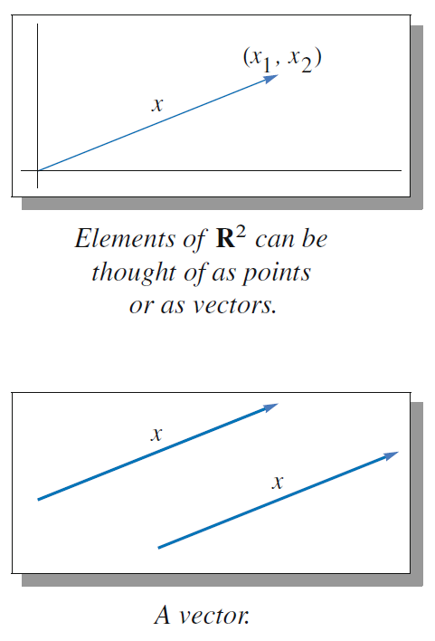

#Linear Algebra Done Right
## 1. Vector space
Complex number $C=\{a+bi : a,b\in R\}$
Lists versus sets: list (3,5) and (5,3) are not equal, set{3,5} and {5,3} are equal.
Definition $F^n$ : $F^n=\{(x_1,x_2,\dots,x_n):x_j\in F for j = 1,\dots,n\}$  
$F^n$ is the set of all lists of length n of element of F

$F^s$ is set of s dimension, is a vector space
$\{(x_1,x_2,0):x_1,x_2\in F\}$ is subspace of $F^3$
## 2. Linear Independence
## 3. Linear maps
## 4. Theory of polynomial
## 5. Proof eigenvalues exist in complex space
## 6. Inner product spaces
## 7. The spectral theorem
## 8. Minimal polynomials,characteristic polynomial and generalized eigenvectors
## 9. Linear operators on real vector spaces
## 10. Trace and determinant
