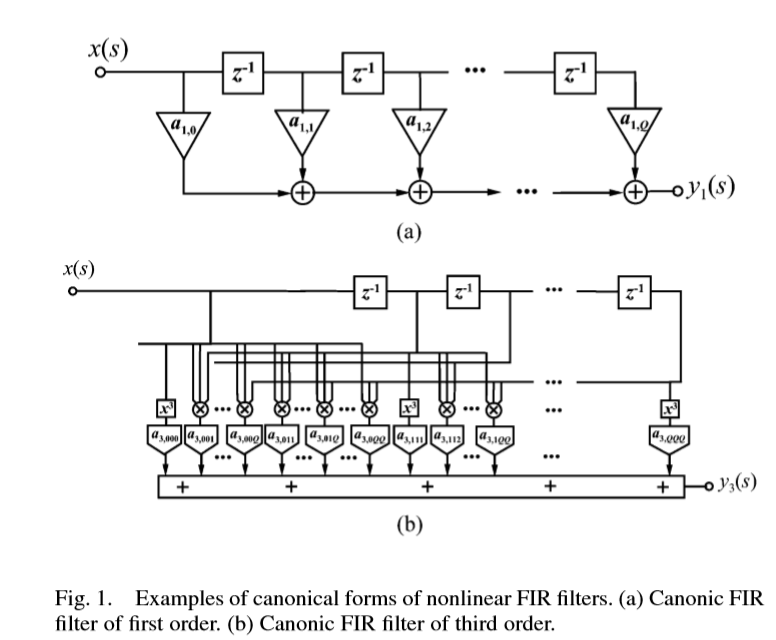

#Overview of PA behavior modeling
##Basic theory of system identification theory
The input and output map of PA can be presented by the following forced nonlinear differential equation:
$f[ y(t),\frac{dy(t)}{dt},\dots,\frac{d^py(t)}{dt^p},x(t),\frac{dx(t)}{dt},\dots,\frac{d^rx(t)}{dt^r}]=0 $
Since the signal is limited by time , using discrete time signal:
$y(s) = f_R [ y(s-1) ,\dots,y(s-Q_1),x(s),x(s-1),\dots,x(s-Q_2)]$
This nonlinear extension of infinite impulse response(IIR) digital filter is assumed general form to which the recursive PA behavior model should obey.
Simplify with non=recursive format :
$y(s)=f_D[x(s),x(s-1),\dots,x(s-Q)]$ It is like finite impulse filter response.

If $f_D$ is approximated by a Taylor series, then this FIR filter is known as Voterra series or Voterra filter.This Voterra series approximation is particularly interesting as it produces the optimal approximation near the point where it was expanded. Therefore, it is known for its good modeling properties of small-signal regimes, but also for its catastrophic degradation under strong nonlinear operation.
If $f_D$ is replaced by a multidimensional Hermite polynomial, it becomes the Wiener series. As the terms of this series are orthogonal to a white Gaussian noise excitation of a predetermined power, the Wiener series produces results that are optimal in the vicinity of that operating power level and for that particular type of input.It is , therefore, amenable for modeling strong nonlinear systems when the excitation bandwidth and statistics can be considered close to those of white Gaussian noise. 

